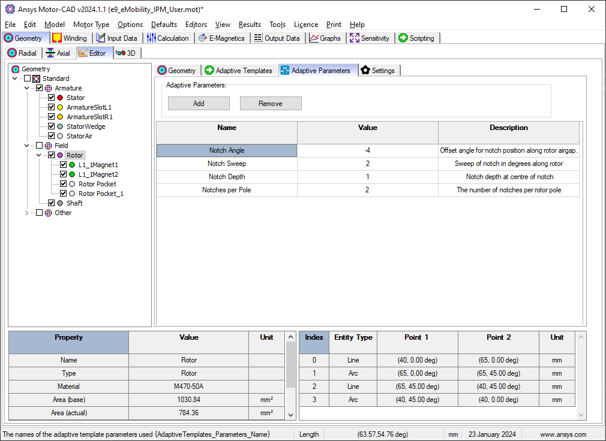

.. _ref_adaptive_templates_UG:

Motor-CAD adaptive templates scripting
======================================

.. note::
    Adaptive Templates in Motor-CAD require v2024.1.2 (Motor-CAD 2024 R1 Update) or later.

This guide describes the Adaptive Templates feature.
Motor-CAD provides the Adaptive Templates feature
for the design of models with geometries that cannot be modelled
using the standard template geometries.
By using the Adaptive Templates feature,
users can generate their own geometric parameterisations
from scratch or based on the Standard Templates.

Using Adaptive Templates, custom geometric parameterisations
are set up using a Python script.

Adaptive Templates examples are available in the PyMotorCAD Documentation
under :ref:`ref_examples_adaptive_templates_library`.
For the examples shown in this user guide,
see :ref:`ref_BPM_Triangular_Rotor_Notches` and :ref:`ref_SYNC_Curve_Flux_Barriers`.

It is recommended that users new to Motor-CAD Adaptive Templates
work through the Tutorial supplied with Motor-CAD.
The tutorial contains additional information and full workflow examples.

Geometry editor
***************

The Geometry -> Editor tab in Ansys Motor-CAD
shows each geometry region currently in use in the model.

.. figure:: ../images/Adaptive_Geometry_GUI_Screenshot.png
    :width: 500pt

    Geometry -> Editor -> Geometry tab in Ansys Motor-CAD 2024 R1

The interface is fully interactive.
Individual geometry regions can be selected
from the region tree or the diagram.

Motor geometry components are grouped by Armature and Field
and represented by regions.
The Editor displays the geometry regions based on their spatial locations,
such that a region's sub-regions are shown as a descendant/child
of their parent region.

The e9 IPM template in Motor-CAD is shown.
In this example, the Magnet and Rotor Pocket regions
(**L1_1Magnet1**, **L2_1Magnet2**, **Rotor Pocket** and **Rotor Pocket_1**)
are shown in a branch underneath the **Rotor** region.
When a region is selected,
region properties are displayed at the bottom-left of the screen
and region entities at the bottom-right.

Region properties include the Name, Type, Material, Area (base and actual),
Position (Centroid, Region Coordinate) and Symmetry of the region.
Region entities include all the Lines and Arcs that define the region.
The **Rotor** region in the e9 IPM template is defined by two lines and two arcs.
If an individual entity is selected from the table,
it is highlighted in the diagram.

Either Cartesian or Polar coordinate systems can be used.
The coordinate system can be changed by going to
Input Data -> Settings -> Geometry.

.. figure:: ../images/Geometry_Coordinate_System_GUI_Screenshot.png
    :width: 500pt

    Input Data -> Settings -> Geometry tab in Ansys Motor-CAD 2024 R1

Adaptive templates script
*************************

Adaptive Templates can be enabled by going to the
Geometry -> Editor -> Adaptive Templates tab
and setting the Geometry Templates Type from **Standard** to **Adaptive**.
This means that the Adaptive Templates Script is run
every time the Motor-CAD geometry is created,
and the scripting interface enabled, which allows editing of the script.

.. figure:: ../images/Adaptive_Templates_GUI_Screenshot.png
    :width: 500pt

    Geometry -> Editor -> Adaptive Templates tab in Ansys Motor-CAD 2024 R1

To set an adaptive geometry for a Motor-CAD file,
a script must be loaded in to the Adaptive Templates tab and run.
Adaptive Templates Python scripts can also be executed externally,
but unless the script is loaded in to the Adaptive Templates tab
in Motor-CAD, the geometry is only defined temporarily.

Adaptive Templates Scripts require PyMotorCAD to be imported.
This Python package provides access to Motor-CAD.

.. code:: python

    import ansys.motorcad.core as pymotorcad

``ansys.motorcad.core`` provides access to the Motor-CAD geometry,
such as the existing regions in the model.
It can be used to get an existing region from the Motor-CAD model
(such as the **Rotor**) as an object in Python (``rotor = mc.get_region("Rotor")``).
It can also be used to set a Motor-CAD region object in the Motor-CAD model
(``mc.set_region(rotor)``).

For a Motor-CAD region object that has been obtained using PyMotorCAD,
the region properties are accessible via Python.
The region object created in Python contains all of the region properties
shown in the Motor-CAD UI and all of the geometry entities that make up the region.

Properties such as the material and colour can be edited with an Adaptive Templates Script:

.. code:: python

     # Connect to Motor-CAD
     mc = pymotorcad.MotorCAD()

     # Get rotor region from Motor-CAD
     rotor = mc.get_region("Rotor")

     # Edit region properties
     rotor.colour = (186, 85, 211)
     rotor.material = "M470-50A"
     mc.set_region(rotor)

    Rotor geometry with modified colour and material shown in the Geometry -> Editor -> Geometry tab

Details on the Adaptive Geometry functions within ``ansys.motorcad.core``
that provide access to the Motor-CAD geometry are available
in the :ref:`ref_MotorCAD_object` under :ref:`ref_Adaptive Geometry_API`.

Using the geometry objects and functions library
------------------------------------------------

Adaptive scripts also require the ``ansys.motorcad.core.geometry`` library
to modify the model geometry.
This provides geometry capability in Python, such as regions and entities.
It is required so that Lines and Arcs can be defined or modified by the script,
and so that regions can be created from these entities.

The geometry package can be imported:

.. code:: python

    import ansys.motorcad.core.geometry as geometry

Alternatively, specific functions (for example Line and Arc) can be imported from the package:

.. code:: python

    from ansys.motorcad.core.geometry import Line, Arc

``ansys.motorcad.core.geometry`` is required to edit the entities that belong to a region,
such as changing the Lines or Arcs that define the region geometry.

Details on the full list of Geometry objects and functions are available
in the :ref:`ref_API_Reference` under :ref:`ref_geometry_functions`.
For examples on modifying a Motor-CAD model geometry,
see :ref:`ref_examples_adaptive_templates_library`.

Adaptive parameters
*******************

An Adaptive Templates script can be set
based on the Standard Template parameters
or based on custom Adaptive Parameters.
Adaptive Parameters are shown in the
Geometry -> Editor -> Adaptive Parameters tab.

    Geometry -> Editor -> Adaptive Parameters tab in Ansys Motor-CAD 2024 R1

Any parameter can be defined, with a Name, Value, and Description.
Parameters can be added within the Motor-CAD interface,
or via Python script by using ``set_adaptive_parameter_value()`` from ``ansys.motorcad.core``:

.. code:: python

    mc.set_adaptive_parameter_value("Notches per Pole", 2)

Adaptive Parameters also appear in the Geometry -> Radial tab,
alongside the Standard Template parameters.

.. figure:: ../images/Adaptive_Parameters_GUI_Screenshot_2.png
    :width: 500pt

    Adaptive Parameters shown in the Geometry -> Radial tab

Adaptive Parameters can be accessed via the Adaptive Templates Script
using ``get_adaptive_parameter_value()`` from ``ansys.motorcad.core``,
so that the geometry can be defined by these Adaptive Parameters:

.. code:: python

    number_notches = int(mc.get_adaptive_parameter_value("Notches per Pole"))

Scripting workflow
*******************

As well as the defined Adaptive Parameters,
any parameter from Motor-CAD
can be used in the Adaptive Templates Script
by using ``get_variable()`` from PyMotorCAD.
Any Motor-CAD API accessible by PyMotorCAD is available.

For example, when modifying the rotor geometry,
it is often necessary to retrieve the rotor radius:

.. code:: python

    rotor_radius = mc.get_variable("RotorDiameter") / 2

Adding a region to the geometry
-------------------------------
To add a new geometry feature to the Motor-CAD model,
such as a notch, the workflow is as follows:

* A new region is created to represent the notch

* The region properties are defined (material, colour etc.)

* Entities are added to the region
  to define the geometry (shape and position)

* The parent region is defined for the new region.
  For a rotor duct, the parent would be set to the rotor region.

* The new region is set in Motor-CAD

Creating a region
~~~~~~~~~~~~~~~~~

To create a new region to represent the notch,
use the Region object from ``ansys.motorcad.core.geometry``:

.. code:: python

    notch = Region()

Defining region properties and parent
~~~~~~~~~~~~~~~~~~~~~~~~~~~~~~~~~~~~~

Region properties can be set using the appropriate field/property:

.. code:: python

    notch.name = "Rotor_Notch_1"
    notch.colour = (255, 255, 255)
    notch.material = "Air"

If the region object of the rotor has been created in Python (``rotor = mc.get_region("Rotor")``)
The rotor region object's properties can be obtained and set for the rotor notch.

The ``Region.duplications`` property represents the symmetry of the region.
In the example shown using the e9 IPM template, ``duplications = 8``
because there are 8 rotor poles of 45 ° symmetry.
In this example, the notch would have the same symmetry as the rotor.

The parent region of the notch can be set to the rotor region,
so that the notch is set as a sub-region.
Motor-CAD uses implicit subtractions,
so that the notch subtraction is handled automatically.
The notch appears as a sub-region of the rotor
in the Geometry -> Editor tab in Motor-CAD.

.. code:: python

    notch.duplications = rotor_region.duplications
    notch.parent = rotor_region

Adding entities to a region
~~~~~~~~~~~~~~~~~~~~~~~~~~~

To add two Lines ``line_1, line_2`` and an Arc ``airgap_arc`` to the notch region,
use the ``Region.add_entity()`` function from ``ansys.motorcad.core.geometry``:

.. code:: python

    notch.add_entity(line_1)
    notch.add_entity(line_2)
    notch.add_entity(airgap_arc)

Line and Arc entities can be defined using Motor-CAD Coordinate objects.

Setting a region in Motor-CAD
~~~~~~~~~~~~~~~~~~~~~~~~~~~~~

To set the notch in the Motor-CAD model,
the notch region is sent to Motor-CAD
using the ``set_region()`` function from ``ansys.motorcad.core``.

``Region.is_closed()`` can be used to ensure that the entities that were added to the region
create a closed region.

.. code:: python

    if notch.is_closed():
        mc.set_region(notch)

Using the geometry shapes library
---------------------------------

Line and Arc entities are defined using Motor-CAD Coordinate objects.
Calculating the coordinate positions can be time consuming and
may require many lines of Python script.

For commonly used shapes, ready made functions can be used
to create a region, based on a few required parameters.
These functions can be imported from the
``ansys.motorcad.core.geometry_shapes`` library.

A function for creating a triangular notch region can be imported:

.. code:: python

    from ansys.motorcad.core.geometry_shapes import triangular_notch

The ``triangular_notch()`` function requires 4 arguments:

* ``radius`` - the radial position of the notch outer edge
  (for a rotor notch, this is the rotor radius)

* ``sweep`` - the sweep of the notch along the rotor airgap, in degrees
  (defines the notch width)

* ``centre_angle`` - the angular position of the notch centre

* ``depth`` - the depth of the notch

.. figure:: ../images/Adaptive_Geometry_Shapes_Diagram.png
    :width: 500pt

    Required arguments for the ``triangular_notch()`` function.

A rotor notch can be defined using this function,
so that the user does not need to calculate
the coordinates for the notch entities.

To use the ``triangular_notch()`` function to create
a triangular rotor notch region:

.. code:: python

    notch = triangular_notch(
        rotor_radius, notch_angular_width, notch_centre_angle, notch_depth
    )

where the arguments ``rotor_radius``, ``notch_angular_width``,
``notch_centre_angle`` and ``notch_depth``
must be calculated in the Adaptive Templates Script and
specified.

The notch region properties can then be defined and
the region can be set in Motor-CAD,
as described earlier in this guide.

For a full Adaptive Templates example
using the workflow described here,
see :ref:`ref_BPM_Triangular_Rotor_Notches`.

Details on the Geometry Shapes functions within ``ansys.motorcad.core.geometry_shapes``
are available in the :ref:`ref_API_Reference` under :ref:`ref_geometry_shapes`.

Creating and modifying adaptive templates scripts
*************************************************

It is recommended to create Adaptive Template Scripts outside Motor-CAD,
using a Python Integrated Development Environment (IDE) (such as PyCharm).
Using an IDE allows for faster creation of the script,
allowing access to autocompletion, code correction
and other features which are not available in the Motor-CAD scripting interface.

This is essential when writing complex scripts,
allowing issues with the script to be fixed
and the inspection of Python objects
(for example geometry regions from Motor-CAD).

For more information on the Synchronous Reluctance machine geometry
with curved flux barriers used for this example,
please see :ref:`ref_SYNC_Curve_Flux_Barriers`.

Working on the adaptive templates script
----------------------------------------
Adaptive templates script can be edited from an external IDE (e.g. PyCharm, VSCode).
When using an external IDE it is important to ensure that the script contains this method before getting/setting any Motor-CAD geometry:

.. code:: python

    mc.reset_adaptive_geometry()

Drawing geometry objects
------------------------
When working on and debugging Adaptive Templates scripts,
it is useful to use the geometry drawing feature
to plot the geometry objects and regions.
``ansys.motorcad.core.geometry_drawing`` contains the function
``draw_objects_debug()`` which can be used to plot any region
that has been defined in Python. This function will only plot regions when called from an external IDE to assist with debugging scripts.
To plot regions from the Motor-CAD scripting interface, use ``draw_objects``.

The geometry drawing package can be imported:

.. code:: python

    from ansys.motorcad.core.geometry_drawing import draw_objects_debug

For an Adaptive Templates script where curved flux barrier/rotor pockets
Region objects are added to a list ``pockets_all_layers``,
the function ``draw_objects_debug()`` can be used to plot the regions:

.. code:: python

    draw_objects_debug(pockets_all_layers)

.. figure:: ../images/Adaptive_Geometry_Drawing_all.png
    :width: 500pt

    Plot of rotor pocket regions drawn using the ``draw_objects()`` function.

