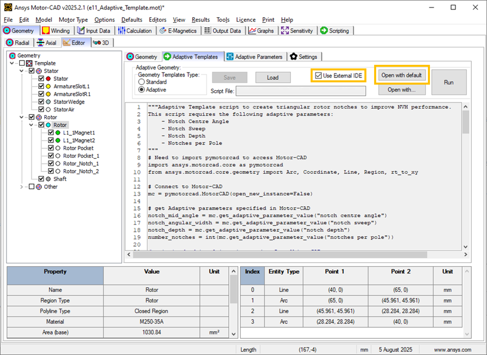

.. _ref_adaptive_templates_UG:

Motor-CAD adaptive templates scripting
======================================

.. note::
    Adaptive Templates in Motor-CAD require v2024.1.2 (Motor-CAD 2024 R1 Update) or later and
    PyMotorCAD v0.4.1. To update PyMotorCAD in Motor-CAD, go to Scripting -> Settings -> PyMotorCAD
    updates and select 'Update to Latest Release'.

This guide describes the Adaptive Templates feature. Motor-CAD provides the Adaptive Templates
feature for the design of models with geometries that cannot be modelled using the standard template
geometries. By using the Adaptive Templates feature, users can generate their own geometric
parameterisations from scratch or based on the Standard Templates.

Using Adaptive Templates, custom geometric parameterisations are set up using a Python script.

Adaptive Templates examples are available in the PyMotorCAD Documentation under
:ref:`ref_examples_adaptive_templates_library`. For the examples shown in this user guide, see
:ref:`ref_BPM_Triangular_Rotor_Notches` and :ref:`ref_SYNC_Curve_Flux_Barriers`.

Those who are new to Motor-CAD Adaptive Templates should work through the tutorial supplied with
Motor-CAD. The tutorial contains additional information and full workflow examples.

Geometry editor
***************

The **Geometry -> Editor** tab in Ansys Motor-CAD shows each geometry region currently in use in the
model.

.. figure:: ../images/Adaptive_Geometry_GUI_Screenshot.png
    :width: 500pt

    **Geometry -> Editor -> Geometry** tab in Ansys Motor-CAD 2024 R1

The interface is fully interactive. Individual geometry regions can be selected from the region tree
or the diagram.

Motor geometry components are grouped by Armature and Field and represented by regions. The Editor
displays the geometry regions based on their spatial locations, such that a region's sub-regions are
shown as a descendant/child of their parent region.

The e9 IPM template in Motor-CAD is shown. In this example, the Magnet and Rotor Pocket regions
(**L1_1Magnet1**, **L2_1Magnet2**, **Rotor Pocket** and **Rotor Pocket_1**) are shown in a branch
underneath the **Rotor** region. When a region is selected, region properties are displayed at the
bottom-left of the screen and region entities at the bottom-right.

Region properties include the Name, Type, Material, Area (base and actual), Position (Centroid,
Region Coordinate) and Symmetry of the region. Region entities include all the Lines and Arcs that
define the region. The **Rotor** region in the e9 IPM template is defined by two lines and two arcs.
If an individual entity is selected from the table, it is highlighted in the diagram.

Either Cartesian or Polar coordinate systems can be used. The coordinate system can be changed by
going to **Input Data -> Settings -> Geometry**.

.. figure:: ../images/Geometry_Coordinate_System_GUI_Screenshot.png
    :width: 500pt

    **Input Data -> Settings -> Geometry** tab in Ansys Motor-CAD 2024 R1

Adaptive templates script
*************************

Adaptive Templates can be enabled by going to the **Geometry -> Editor -> Adaptive Templates** tab
and setting the Geometry Templates Type from **Standard** to **Adaptive**. This means that the
Adaptive Templates script is run every time the Motor-CAD geometry is created, and the scripting
interface enabled, which allows editing of the script.

.. figure:: ../images/Adaptive_Templates_GUI_Screenshot.png
    :width: 500pt

    **Geometry -> Editor -> Adaptive Templates** tab in Ansys Motor-CAD 2024 R1

To set an adaptive geometry for a Motor-CAD file, a script must be loaded in to the
**Adaptive Templates** tab and run. Adaptive Templates Python scripts can also be executed
externally, but unless the script is loaded in to the **Adaptive Templates** tab in Motor-CAD, the
geometry is only defined temporarily.

Adaptive Templates Scripts require PyMotorCAD to be imported. This Python package provides access to
Motor-CAD.

.. code:: python

    import ansys.motorcad.core as pymotorcad

``ansys.motorcad.core`` provides access to the Motor-CAD geometry, such as the existing regions in
the model. It can be used to get an existing region from the Motor-CAD model (such as the **Rotor**)
as an object in Python (``rotor = mc.get_region("Rotor")``). It can also be used to set a Motor-CAD
region object in the Motor-CAD model (``mc.set_region(rotor)``).

For a Motor-CAD region object that has been obtained using PyMotorCAD, the region properties are
accessible via Python. The region object created in Python contains all of the region properties
shown in the Motor-CAD UI and all of the geometry entities that make up the region.

Properties such as the material and colour can be edited with an Adaptive Templates Script:

.. code:: python

     # Connect to Motor-CAD
     mc = pymotorcad.MotorCAD()

     # Get rotor region from Motor-CAD
     rotor = mc.get_region("Rotor")

     # Edit region properties
     rotor.colour = (186, 85, 211)
     rotor.material = "M470-50A"
     mc.set_region(rotor)

.. figure:: ../images/Adaptive_Geometry_GUI_Screenshot_UG_Modified.png
    :width: 500pt

    Rotor geometry with modified colour and material shown in the **Geometry -> Editor -> Geometry**
    tab

Details on the Adaptive Geometry functions within ``ansys.motorcad.core`` that provide access to the
Motor-CAD geometry are available in the :ref:`ref_MotorCAD_object` under
:ref:`ref_Adaptive Geometry_API`.

Using the geometry objects and functions library
------------------------------------------------

Adaptive scripts also require the ``ansys.motorcad.core.geometry`` library to modify the model
geometry. This provides geometry capability in Python, such as regions and entities. It is required
so that Lines and Arcs can be defined or modified by the script, and so that regions can be created
from these entities.

The geometry package can be imported:

.. code:: python

    import ansys.motorcad.core.geometry as geometry

Alternatively, specific functions (for example Line and Arc) can be imported from the package:

.. code:: python

    from ansys.motorcad.core.geometry import Line, Arc

``ansys.motorcad.core.geometry`` is required to edit the entities that belong to a region, such as
changing the Lines or Arcs that define the region geometry.

Details on the full list of Geometry objects and functions are available in the
:ref:`ref_API_Reference` under :ref:`ref_geometry_functions`. For examples on modifying a Motor-CAD
model geometry, see :ref:`ref_examples_adaptive_templates_library`.

Adaptive parameters
*******************

An Adaptive Templates script can be set based on the Standard Template parameters or based on custom
Adaptive Parameters. Adaptive Parameters are shown in the
**Geometry -> Editor -> Adaptive Parameters** tab.

.. figure:: ../images/Adaptive_Parameters_GUI_Screenshot.png
    :width: 500pt

    **Geometry -> Editor -> Adaptive Parameters** tab in Ansys Motor-CAD 2024 R1

Any parameter can be defined, with a name, value, and description. Parameters can be added within
the Motor-CAD interface, or with a Python script. You can define an Adaptive Parameter, along with a
default parameter value, in the Adaptive Templates script. To do so, use the
``set_adaptive_parameter_default()`` method from ``ansys.motorcad.core``:

.. code:: python

    mc.set_adaptive_parameter_default("Notches per Pole", 2)

This checks whether the Adaptive Parameter already exists. If the parameter does not exist, it
creates the parameter and sets the value to the specified default value. If the parameter already
exists in Motor-CAD, the current value is kept and it is **not** set to the default value. To
set an Adaptive Parameter value, you can use the ``set_adaptive_parameter_value()`` method from
``ansys.motorcad.core``.

Adaptive Parameters also appear in the **Geometry -> Radial** tab, alongside the Standard Template
parameters.

.. figure:: ../images/Adaptive_Parameters_GUI_Screenshot_2.png
    :width: 500pt

    Adaptive Parameters shown in the **Geometry -> Radial** tab

Adaptive Parameters can be accessed with the Adaptive Templates script using the
``get_adaptive_parameter_value()`` method from ``ansys.motorcad.core``, so that the geometry can be
defined by these Adaptive Parameters:

.. code:: python

    number_notches = int(mc.get_adaptive_parameter_value("Notches per Pole"))

Scripting workflow
*******************

As well as the defined Adaptive Parameters, any parameter from Motor-CAD can be used in the Adaptive
Templates script by using the ``get_variable()`` method from PyMotorCAD. Any Motor-CAD API
accessible by PyMotorCAD is available.

For example, when modifying the rotor geometry, it is often useful to retrieve the rotor radius:

.. code:: python

    rotor_radius = mc.get_variable("RotorDiameter") / 2

Adding a region to the geometry
-------------------------------
To add a new geometry feature to the Motor-CAD model, such as a notch, the workflow is as follows:

#. A new region is created to represent the notch.

#. The region properties are defined (material, colour etc.).

#. Entities are added to the region to define the geometry (shape and position).

#. The parent region is defined for the new region (for a rotor duct example, the parent would be
   set to the rotor region).

#. The new region is set in Motor-CAD.

Creating a region
~~~~~~~~~~~~~~~~~

To create a new region to represent the notch, use the Region object from
``ansys.motorcad.core.geometry``:

.. code:: python

    notch = Region(region_type=RegionType.rotor_air)

When creating new regions, it is recommended to set the
``RegionType`` to the appropriate type of geometry component. For a full list of available region
types, see the ``RegionType`` entry under :ref:`ref_geometry_functions`.

Defining region properties and parent
~~~~~~~~~~~~~~~~~~~~~~~~~~~~~~~~~~~~~

Region properties can be set using the appropriate field/property:

.. code:: python

    notch.name = "Rotor_Notch_1"
    notch.colour = (255, 255, 255)
    notch.material = "Air"

If the region object of the rotor has been created in Python (``rotor = mc.get_region("Rotor")``),
the rotor region object's properties can be obtained and set for the rotor notch.

The ``Region.duplications`` property represents the symmetry of the region. In the example shown
using the e9 IPM template, ``duplications = 8`` because there are **8** rotor poles of **45 °**
symmetry. In this example, the notch would have the same symmetry as the rotor.

The parent region of the notch can be set to the rotor region so that the notch is set as a
sub-region. Motor-CAD uses implicit subtractions so that the notch subtraction is handled
automatically. The notch appears as a sub-region of the rotor in tree shown in the
**Geometry -> Editor** tab in Motor-CAD.

.. code:: python

    notch.duplications = rotor_region.duplications
    notch.parent = rotor_region

Adding entities to a region
~~~~~~~~~~~~~~~~~~~~~~~~~~~

The geometry of a Region is made up of entities (Line and Arc objects). When entities are added to
a Region, they **must** be added in anticlockwise order.

To add two Lines ``line_1, line_2`` and an Arc ``airgap_arc`` to the notch region, use the
``Region.add_entity()`` function from ``ansys.motorcad.core.geometry``:

.. code:: python

    notch.add_entity(line_1)
    notch.add_entity(line_2)
    notch.add_entity(airgap_arc)

Line and Arc entities can be defined using Motor-CAD Coordinate objects. The ``Region.add_entity()``
method adds an entity to the Region at the end of the entity list. Alternatively, the
``Region.insert_entity()`` method inserts an entity at a specified index of the entity list,
allowing new entities to be inserted between two existing entities.

    Three entities, **e0** (``line_1``), **e1** (``line_2``) and **e2** (``airgap_arc``), making up
    a triangular notch Region. The entities are in order going anti-clockwise around the Region.

Because the entities have been correctly added in anti-clockwise order:

* The end point ``line_1.end`` is the start point ``line_2.start`` (**p1**),

* the end point ``line_2.end`` is the start point ``airgap_arc.start`` (**p2**) and

* the end point ``airgap_arc.end`` is the start point ``line_1.start`` (**p0**).

This means that the Region is closed and could be set in Motor-CAD.

Setting a region in Motor-CAD
~~~~~~~~~~~~~~~~~~~~~~~~~~~~~

To set the notch in the Motor-CAD model, the notch region is sent to Motor-CAD using the
``set_region()`` function from ``ansys.motorcad.core``.

``Region.is_closed()`` can be used to ensure that the entities that were added to the region create
a closed region.

.. code:: python

    if notch.is_closed():
        mc.set_region(notch)

Attempting to set a Region in Motor-CAD that is not closed, or where the entities are not in
anti-clockwise order, may cause issues with the geometry and the FEA calculation may fail.

Using the geometry shapes library
---------------------------------

Line and Arc entities are defined using Motor-CAD Coordinate objects. Calculating the coordinate
positions can be time-consuming and can require many lines of Python script.

For commonly used shapes, ready made functions can be used to create a region, based on a few
required parameters. These functions can be imported from the
``ansys.motorcad.core.geometry_shapes`` library.

A function for creating a triangular notch region can be imported:

.. code:: python

    from ansys.motorcad.core.geometry_shapes import triangular_notch

The ``triangular_notch()`` function requires four arguments:

* ``radius``: Radial position of the notch outer edge. (For a rotor notch, this is the rotor
  radius.)

* ``sweep`` - Sweep of the notch along the rotor airgap, in degrees. (This parameter defines the
  notch width.)

* ``centre_angle`` - Angular position of the notch centre.

* ``depth`` - Depth of the notch

.. figure:: ../images/Adaptive_Geometry_Shapes_Diagram.png
    :width: 500pt

    Required arguments for the ``triangular_notch()`` function.

A rotor notch can be defined using this function so that the coordinates for the notch entities do
not need to be calculated.

To use the ``triangular_notch()`` function to create a triangular rotor notch region:

.. code:: python

    notch = triangular_notch(
        rotor_radius, notch_angular_width, notch_centre_angle, notch_depth
    )

The arguments, ``rotor_radius``, ``notch_angular_width``, ``notch_centre_angle`` and
``notch_depth`` must be calculated in the Adaptive Templates script and specified.

The notch region properties can then be defined and the region can be set in Motor-CAD, as described
earlier.

For a full Adaptive Templates example using the workflow described here, see
:ref:`ref_BPM_Triangular_Rotor_Notches`.

Details on the Geometry Shapes functions within ``ansys.motorcad.core.geometry_shapes`` are
available in the :ref:`ref_API_Reference` under :ref:`ref_geometry_shapes`.

Create and modify adaptive templates scripts
********************************************

Adaptive Template Scripts should be created outside Motor-CAD, using a Python Integrated Development
Environment (IDE) (such as PyCharm). Using an IDE allows for faster creation of the script, allowing
access to autocompletion, code correction and other features which are not available in the
Motor-CAD scripting interface.

This is essential when writing complex scripts, allowing issues with the script to be fixed and the
inspection of Python objects, such as geometry regions from Motor-CAD.

Working on the adaptive templates script
----------------------------------------
it is important to ensure that the Adaptive Template script contains this method before getting or
setting any Motor-CAD geometry:

.. code:: python

    mc.reset_adaptive_geometry()

Adaptive Templates scripts can be edited from an external IDE (for example PyCharm, VSCode). To work
on an Adaptive Templates script in an IDE, go to the **Geometry -> Editor -> Adaptive Templates**
tab and select **Adaptive** under **Geometry Templates Type**. Save the script to a convenient
location, and tick the **Use External IDE** option. The Adaptive Templates script is greyed-out and
unavailable to edit within the Motor-CAD GUI when this option is selected.

To open the Adaptive Templates script file in your default IDE, click **Open with default**. To
choose a specific IDE, click **Open with**.

    **Use External IDE** options in the Motor-CAD GUI.

Adaptive Templates scripts should use the ``open_new_instance=False`` option when connecting to
Motor-CAD.

.. code:: python
    mc = pymotorcad.MotorCAD(open_new_instance=False)

Once the Adaptive Templates script is opened in the IDE, you can take advantage of functions such as
doc strings and debugging when working on the script. The Adaptive Templates script can be run within
the IDE, and the commands communicate with the open Motor-CAD instance when the
``open_new_instance=False`` option is used.

For example, you can add a break point and run a script in debug mode to investigate the variables.
In the screenshot below, a break point has been added to pause the script before setting a new notch
region in Motor-CAD. Looking into the variables, you can find the ``notch`` region object and
investigate its attributes and properties. It has 3 entities (two Line objects and one Arc object).

    Using a break point in an Adaptive Template script to investigate variables.

This is a useful tool when working on a Python script, such as an Adaptive Templates script. You can
look into the properties of the Region object, as well as those of the entities such as the start,
end and midpoint coordinates, the angles of Line objects, the radii of Arc objects.

IDEs such as PyCharm have a lot of useful features for editing Python scripts. It is much easier and
more efficient to use an IDE to develop Adaptive Templates scripts, rather than the editor within
the Motor-CAD GUI. The Motor-CAD GUI is best suited for making small edits to a script.

Drawing geometry objects
------------------------
When working on and debugging Adaptive Templates scripts, it is useful to use the geometry drawing
feature to plot the geometry objects and regions. ``ansys.motorcad.core.geometry_drawing`` contains
the ``draw_objects()`` function, which can be used to plot any region that has been defined in
Python.

By default, this function only plots regions when called from an external IDE to assist with
debugging scripts. To plot regions from the Motor-CAD scripting interface, use the option
``draw_objects(objects, draw_internal=True)``.

It can also be useful to draw the points and region labels, which can be enabled using the options
``draw_objects(objects, label_regions=True, draw_points=True)``. For more information on the
different options available with the ``draw_objects()`` function, see :ref:`ref_geometry_drawing`.

The geometry drawing package can be imported:

.. code:: python

    from ansys.motorcad.core.geometry_drawing import draw_objects

In the :ref:`ref_SYNC_Curve_Flux_Barriers` example, curved flux barrier (rotor pockets) region
objects are added to a list, ``pockets_all_layers``. For more information on the Synchronous
Reluctance machine geometry with curved flux barriers used for this example, see
:ref:`ref_SYNC_Curve_Flux_Barriers`.

The ``draw_objects()`` function can be used to plot the regions:

.. code:: python

    draw_objects(pockets_all_layers, label_regions=True, draw_points=True)

.. figure:: ../images/Adaptive_Geometry_Drawing_all_updated.png
    :width: 500pt

    Plot of rotor pocket regions drawn using the ``draw_objects()`` function.

Add imported DXF geometries to adaptive templates
*************************************************
Custom geometry can be imported to Motor-CAD from a DXF file. For information on how to import
custom geometry from a DXF file, see the "Custom Machine Geometries" tutorial supplied with
Motor-CAD.

Once a custom geometry is imported, it is automatically separated into regions, which appear under
**Import** in the **Geometry -> Editor** tab. These imported geometry regions are accessed using
the ``get_region_dxf()`` method from the ``ansys.motorcad.core`` API. The geometry regions that are
currently set in the Motor-CAD model are shown under **Template** in the tree.

    **Geometry -> Editor -> Geometry** tab with an imported custom geometry from DXF file.

By default, the imported regions are not displayed. To display an imported region, select the
checkbox.

Imported regions are not automatically set in the Motor-CAD model or used by the Motor-CAD
calculations. To customise the Motor-CAD template geometry with the imported geometry, use Adaptive
Templates.

Use the ``get_region_dxf()`` method in an adaptive templates script to access an imported region.
You can then modify and interact with the region in the same way as for any other region object.
The name, properties, and parent regions of the imported region can be defined.

To replace an existing region with an imported DXF region, use the ``Region.replace()`` method.

As with any region object, it is set in the Motor-CAD model using the ``set_region()`` method. The
imported region then appears under **Template** in the Geometry tree shown in the
**Geometry -> Editor -> Geometry** tab in Motor-CAD.

Best practices for Adaptive Templates scripting
***********************************************

Adaptive Templates scripts in Motor-CAD can be used in many different ways to customise the electric
machine geometry. Some approaches are more challenging than others. For some types of geometry
customisation, there are some recommended approaches and best practices that should be followed.

Modifying stator slot openings
------------------------------

When using Adaptive Templates to modify the shape of the stator slot opening, there are some best
practices which may be followed to make the process simpler.

If the modifications reduce the available space for conductors, then the **Copper Depth [%]**
parameter in the **Winding -> Definition** tab should be adjusted to reflect the available space for
conductors in the updated slot.

    A Motor-CAD stator geometry where the stator slot has been modified to be narrower at the slot
    opening. The **Stator** region (red, shaded) intersects the **ArmatureSlot** regions (yellow)
    and the **Wedge** region (grey). The **Copper Depth [%]** is still set to **100 %**, so the
    **ArmatureSlot** regions are still being drawn based on the unmodified Standard Template
    geometry.

.. figure:: ../images/adaptive_templates/user_guide_slots_2.png
    :width: 500pt

    The **Winding -> Definition** tab in Motor-CAD. Setting the **Copper Depth [%]** to **84 %**
    means that the conductors, impregnation and slot liner now only fill 84 % of the slot. This
    reflects the amount of space available in the modified slot.

.. figure:: ../images/adaptive_templates/user_guide_slots_3.png
    :width: 600pt

    With the updated **Copper Depth [%]**, the **Stator** region (red, shaded) no longer intersects
    the **ArmatureSlot** regions, only the **Wedge** region (grey).

To modify the shape of the **Wedge** region based on a modified **Stator** slot geometry, subtract
the **Stator** region from the **Wedge**:

.. code:: python

    wedge = mc.get_region("Wedge")
    wedge.subtract(modified_stator)
    mc.set_region(wedge)

.. figure:: ../images/adaptive_templates/user_guide_slots_4.png
    :width: 600pt

    When the **Wedge** region has been modified by subtracting the modified **Stator** region, the
    custom stator slot geometry is complete.

    The updated stator slot can also be visualised in the **Winding -> Definition** tab, now that
    the wedge has been updated.

Rounding corners of geometry regions with Adaptive Templates
------------------------------------------------------------

The Motor-CAD Standard Template geometry has options for automatic corner rounding of the rotor
lamination and magnets (found on the **Input Data -> Settings -> Geometry** tab). When corner
rounding is enabled, the sharp corners of regions are modified, inserting Arc entities at the
corners.

.. figure:: ../images/adaptive_templates/user_guide_corner_rounding_1.png
    :width: 750pt

    The e10 IPM template rotor geometry in Motor-CAD without (left) and with (right) corner rounding
    enabled for the rotor lamination and magnets.

Looking closely at an the e10 IPM Motor-CAD template example, when corner rounding is not enabled,
the **Rotor Pocket** regions have an inner corner formed by two Line entities (entity 3 and 4).

.. figure:: ../images/adaptive_templates/user_guide_corner_rounding_2.png
    :width: 500pt

    A corner made up of two Line entities (entity 3 and 4).

When corner rounding is enabled, the **Rotor Pocket** region is made up of a larger number of
entities. The same corner is now formed from two Line entities (entity 7 and 9) with an Arc between
them (entity 8). The lines have been shortened and an Arc has been inserted between them at the
corner.

    A corner made up of two Line entities (entity 7 and 9) and an Arc (entity 8).

When customising a Motor-CAD geometry with Adaptive Templates, it is much simpler to modify the
geometry when corner rounding is **not selected**. This is because there will be fewer entities
forming the regions (such as the rotor pocket and magnet regions). It is recommended to set the
**Corner Rounding (Rotor Lamination)** and **Corner Rounding (Magnets)** parameters on the
**Input Data -> Settings -> Geometry** tab to **None (default)**.

.. figure:: ../images/adaptive_templates/user_guide_corner_rounding_4.png
    :width: 500pt

    The **Input Data -> Settings -> Geometry** tab in Motor-CAD, showing the corner rounding options
    for the Standard Template geometry.

The recommended best practice when using Adaptive Templates, is to first create the custom geometry
with 'sharp' corners, and subsequently round the corners. The ``Region.round_corner()`` and
``Region.round_corners()`` methods can be used for automatically shortening the adjacent entities of
a corner, and inserting an Arc.

Considering the :ref:`ref_Trapezoidal_Ducts` example, where a Standard Template geometry is set up
with rectangular rotor ducts and the ducts are modified with Adaptive Templates to form trapezoid
shapes. Rectangular ducts in Motor-CAD have a **RDuct Corner Rad** parameter (separate from the
**Corner Rounding (Rotor Lamination)** parameter discussed earlier), which should be set to **0 mm**
when the rectangular duct is to be modified with Adaptive Templates. In this example, the ducts are
modified by shortening the top line of the rectangular duct according to an Adaptive Parameter value
(**Trapezoid_base_ratio**). For the full example, see :ref:`ref_Trapezoidal_Ducts`.

    Standard Template geometry with a rectangular rotor duct (left) and Adaptive Templates geometry
    where the duct has been modified into a trapezoid shape (right).

Once the ducts have been modified to form trapezoid shapes, the corners can be rounded using the
``Region.round_corners()`` method before the updated Region is set in Motor-CAD. This method
requires two arguments:

* The corner coordinates that are to be rounded

* A corner radius to be applied to all corners

To get a list of all the region points, you can use ``duct_region.points``.

.. code:: python

    # edit the rectangular duct to form trapezoid duct:
    duct_region.edit_point(entity.start, new_start_point)
    duct_region.edit_point(entity.end, new_end_point)

    # draw the trapezoidal duct region before rounding the corners
    draw_objects(duct_region, label_regions=True, draw_points=True)

    # round the trapezoidal duct corners
    duct_region.round_corners(duct_region.points, 1.5)

    # draw the rounded trapezoidal duct region
    draw_objects(duct_region, label_regions=True, draw_points=True)

    # set the modified duct region in Motor-CAD
    mc.set_region(duct_region)

For each of the corner coordinates, the ``Region.round_corners()`` method shortens the entities that
are adjacent to the corners and inserts Arc entities with the specified corner radius (**1.5 mm**).
The result is a modified Region with rounded corners.

    Figures plotted using the ``draw_objects()`` function of a trapezoidal rotor duct without (left)
    and with (right) corners rounded by a radius of **1.5 mm**.

.. figure:: ../images/adaptive_templates/user_guide_corner_rounding_7.png
    :width: 400pt

    The updated rotor geometry with trapezoidal rotor duct in Motor-CAD.

To apply different corner radii for each corner, you can use the ``Region.round_corner()`` method
and round corners individually.

