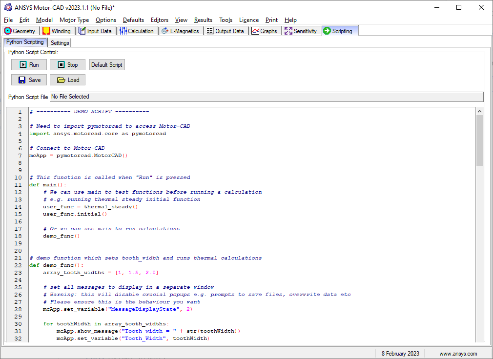

.. _ref_internal_scripting:

Motor-CAD internal **Scripting** tab
====================================

The **Scripting** tab in Motor-CAD facilitates creating, editing, loading, and
saving internal Python scripts within Motor-CAD.

.. figure:: ../images/scriptingtab_UG.png
    :width: 500pt

    Scripting -> Settings tab in Ansys Motor-CAD 2023 R1

From the **Scripting** tab in Motor-CAD, you can connect from an internal script by
accessing the ``MotorCAD()`` object with this code:

.. code:: python

    import ansys.motorcad.core as pymotorcad

    mcApp = pymotorcad.MotorCAD()

With the :ref:`ref_MotorCAD_object`, you can use PyMotorCAD methods to send commands
to the current Motor-CAD instance. For example, you can set and get values before,
during, and after calculations. You can also create a script for Motor-CAD automation.

In the following image, the **Scripting** tab shows the demo script. You can use this
default script as a starting point for scripting internally in Motor-CAD. However, you
can also add and run any Python script from this tab.

    Scripting -> Python Scripting tab in Ansys Motor-CAD 2023 R1

Demo script example
*******************

The demo script is shown by defualt on the **Scripting** tab in Moto-CAD to
provideg examples of how you use PyMotorCAD methods and Motor-CAD automation
parameters.

For more information, see the Motor-CAD Automation tutorial (section 2.iii),
provided with the Motor-CAD installation.

Setup
-----
Import :code:`pymotorcad` to access Motor-CAD.

.. code:: python

    import ansys.motorcad.core as pymotorcad

Connect to Motor-CAD.

.. code:: python

    mcApp = pymotorcad.MotorCAD()

Main function
--------------
The :code:`main` function is called when **Run** is pressed in the Motor-CAD GUI.
You can use the :code:`main` function to test other functions before running a
calculation. For example, you can use it to run the ``thermal_steady()`` and
``initial()`` functions. You can also use it to run calculations within another
defined function, such as the :code:`demo_func` function.

.. code:: python

    def main():
        user_func = thermal_steady()
        user_func.initial()

        demo_func()

Demo function
--------------
The defined :code:`demo_func` function sets the :code:`tooth_width` function and
runs thermal calculations.

All messages are set to display in a separate window using this PyMotorCAD method:

:code:`mcApp.set_variable("MessageDisplayState", 2)`

 .. note::
    This PyModerCAD method disables crucial popups, including prompts to save files
     and overwrite data. Ensure that this is the desired behavior.

The :code:`demo_func` function defines a range of values for the :code:`tooth_width`
function, runs a steady state thermal calculation, and gets the average winding
temperature for each. Results are shown in the message window.
The last line of the function resets the message window.

.. code:: python

    def demo_func():
        array_tooth_widths = [1, 1.5, 2.0]

        mcApp.set_variable("MessageDisplayState", 2)

        for toothWidth in array_tooth_widths:
            mcApp.show_message("Tooth width = " + str(toothWidth))
            mcApp.set_variable("Tooth_Width", toothWidth)
            mcApp.do_steady_state_analysis()
            temperature = mcApp.get_variable(
                "T_[WINDING_AVERAGE]",
            )
            mcApp.show_message("Winding temperature = " + str(temperature))

        mcApp.set_variable("MessageDisplayState", 0)

Functions run during Calculations
----------------------------------
The previously described functions run only when the **Run During Analysis** option
is selected from the **Scripting -> Settings** tab in Motor-CAD. (This option appears
under the **Script Control** heading.)

.. figure:: ../images/scriptingtab_UG.png
    :width: 500pt

    Scripting -> Settings tab in Ansys Motor-CAD 2023 R1

If the **Run During Analysis** option is selected, the script is imported.
This means that anything other than setting up the ``MotorCAD`` object should
be moved to a function or class to avoid unexpected behavior.

Five classes are defined: :code:`thermal_steady`, :code:`thermal_transient`,
:code:`emagnetic`, :code:`mechanical_stress` and :code:`mechanical_forces`.
Each of these classes contains the :code:`initial` and :code:`final` functions.
The thermal classes also contain the :code:`main` function.

- :code:`initial` is called before the calculation.
- :code:`final` is called after the calculation.
- :code:`main` is called before each time step in a calculation.

The :code:`thermal_steady` class contains functions for steady-state
thermal calculations:

.. code:: python

    class thermal_steady:
        def initial(self):
            self.step = 0
            print("Thermal Steady State - Initial")

        def main(self):
            self.step = self.step + 1
            print("Step: " + str(self.step) + ". Thermal Steady State - Main")

        def final(self):
            print("Thermal Steady State - Final")

The :code:`thermal_transient` class contains functions for transient
thermal calculations:

.. code:: python

    class thermal_transient:
        def initial(self):
            self.step = 0
            print("Thermal Transient - Initial")

        def main(self):
            self.step = self.step + 1
            print("Step: " + str(self.step) + ". Thermal Transient State - Main")

        def final(self):
            print("Thermal Transient - Final")

The :code:`emagnetic` class contains functions for electromangetic calculations:

.. code:: python

    class emagnetic:
        def initial(self):
            print("E-Magnetic - Initial")

        def final(self):
            print("E-Magnetic - Final")

The :code:`mechanical_stress` class contains functions for mechanical stress calculations:

.. code:: python

    class mechanical_stress:
        def initial(self):
            print("Mech Stress - Initial")

        def final(self):
            print("Mech Stress - Final")

The :code:`mechanical_forces` class contains functions for mechanical force calculations:

.. code:: python

    class mechanical_forces:
        def initial(self):
            print("Mech Forces - Initial")

        def final(self):
            print("Mech Forces - Final")

For any scripts that are to be run before, during, or after a particular Motor-CAD
calculation, these functions can be added to the relevant functions.
