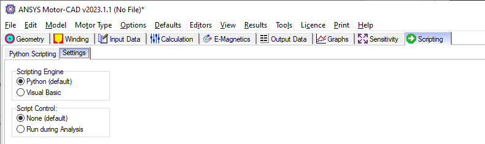

Motor-CAD internal Scripting tab
==================================

The internal scripting tab facilitates the creating, editing, loading, and saving of internal Python scripts in Motor-CAD.

    Scripting -> Settings tab in Ansys Motor-CAD v2023R1

To connect with Motor-CAD from an internal script on the Scripting tab, access the ``MotorCAD()`` object as follows:

.. code:: python

    import ansys.motorcad.core as pymotorcad

    mcApp = pymotorcad.MotorCAD()

PyMotorCAD methods can then be used to send commands to the current Motor-CAD instance with the object ``mcApp``.
This can be used to set and get values before, during, and after calculations, and to create a script for Motor-CAD automation.

A Default Script is shown on the Scripting Tab, which can be used as a starting point for users that wish to script
internally in Motor-CAD.

.. figure:: ../images/scriptingtab_UG_2.png
    :width: 500pt

    Scripting -> Python Scripting tab in Ansys Motor-CAD v2023R1

The :ref:`ref_scripting_tab_demo` can be found under :ref:`ref_examples` along with more information and details.

Alternatively, any Python script may be added here and run from this tab.

