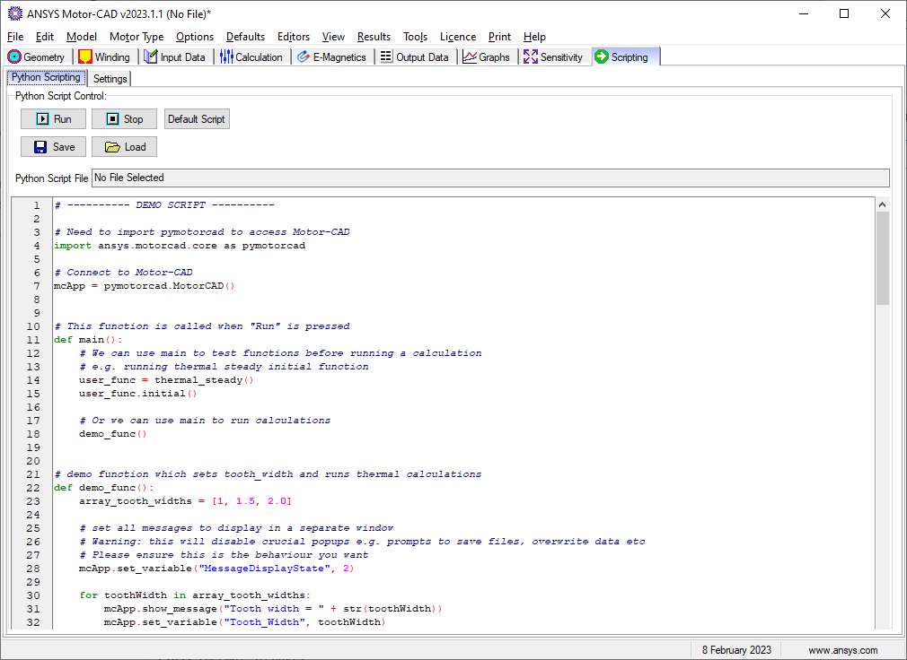

.. _ref_internal_scripting:

Motor-CAD Internal Scripting Tab
==================================

The internal scripting tab facilitates the creating, editing, loading, and saving of internal Python scripts in Motor-CAD.

.. figure:: ../images/scriptingtab_UG.png
    :width: 500pt

    Scripting -> Settings tab in Ansys Motor-CAD v2023R1

To connect with Motor-CAD from an internal script on the Scripting tab, access the ``MotorCAD()`` object as follows:

.. code:: python

    import ansys.motorcad.core as pymotorcad
    mcApp = pymotorcad.MotorCAD()

PyMotorCAD methods can then be used to send commands to the current Motor-CAD instance with the object ``mcApp``.
This can be used to set and get values before, during, and after calculations, and to create a script for Motor-CAD automation.

A Default Script is shown on the Scripting Tab, which can be used as a starting point for users that wish to script
internally in Motor-CAD.

    Scripting -> Python Scripting tab in Ansys Motor-CAD v2023R1

Alternatively, any Python script may be added here and run from this tab.

Motor-CAD Scripting Tab demo script
************************************

This demo script is the Default Script for the internal Scripting Tab within Motor-CAD,
providing examples of how PyMotorCAD methods and Motor-CAD automation parameters
should be used.

See the Motor-CAD Automation tutorial (section 2.iii),
provided with a Motor-CAD installation, for more information.

Setup
-----
Import :code:`pymotorcad` to access Motor-CAD

.. code:: python

    import ansys.motorcad.core as pymotorcad

Connect to Motor-CAD

.. code:: python

    mcApp = pymotorcad.MotorCAD()

Main Function
--------------
The function :code:`main` is called when "Run" is pressed in the Motor-CAD GUI.
:code:`main` can be used to test functions before running a calculation
e.g. running thermal steady initial function.
Alternatively, it can be used to run calculations within another defined function,
such as :code:`demo_func`.

.. code:: python

    def main():
        user_func = thermal_steady()
        user_func.initial()

        demo_func()

Demo Function
--------------
A demo function is defined, which sets the :code:`tooth_width` and runs thermal calculations.

All messages are set to display in a separate window using the PyMotorCAD method:
:code:`mcApp.set_variable("MessageDisplayState", 2)`

 .. note::
    This will disable crucial popups e.g. prompts to save files, overwrite data etc.
    Ensure that this is the desired behaviour.

The demo function will define a range of values for the :code:`tooth_width`,
run a Steady State Thermal calculation and get the average winding temperature for each.
The results will be shown in the Message Display window.
The last line of the function restores the message dialogs again.

.. code:: python

    def demo_func():
        array_tooth_widths = [1, 1.5, 2.0]

        mcApp.set_variable("MessageDisplayState", 2)

        for toothWidth in array_tooth_widths:
            mcApp.show_message("Tooth width = " + str(toothWidth))
            mcApp.set_variable("Tooth_Width", toothWidth)
            mcApp.do_steady_state_analysis()
            temperature = mcApp.get_variable("T_[WINDING_AVERAGE]",)
            mcApp.show_message("Winding temperature = " + str(temperature))

        mcApp.set_variable("MessageDisplayState", 0)

Functions Run during Calculations
----------------------------------
These functions will only run when the option "Run During Analysis" is selected from the
Scripting -> Settings tab in Motor-CAD (found under Script Control).

.. figure:: ../images/scriptingtab_UG.png
    :width: 500pt

    Scripting -> Settings tab in Ansys Motor-CAD v2023R1

If "Run During Analysis" is selected then this script will be imported.
This means that anything other than setting up the MotorCAD object should be moved to a
function/class to avoid unexpected behaviour.

Five classes are defined: :code:`thermal_steady`, :code:`thermal_transient`,
:code:`emagnetic`, :code:`mechanical_stress` and :code:`mechanical_forces`.
Each contains multiple functions: :code:`initial`, :code:`final` and, for the
thermal classes, :code:`main`.

:code:`initial` is called before the calculation

:code:`final` is called after the calculation

:code:`main` is called before each time step in a calculation

The class :code:`thermal_steady` contains functions for steady-state thermal calculations:

.. code:: python

    class thermal_steady:
        def initial(self):
            self.step = 0
            print("Thermal Steady State - Initial")

        def main(self):
            self.step = self.step + 1
            print("Step: " + str(self.step) + ". Thermal Steady State - Main")

        def final(self):
            print("Thermal Steady State - Final")

The class :code:`thermal_transient` contains functions for transient thermal calculations:

.. code:: python

    class thermal_transient:
        def initial(self):
            self.step = 0
            print("Thermal Transient - Initial")

        def main(self):
            self.step = self.step + 1
            print("Step: " + str(self.step) + ". Thermal Transient State - Main")

        def final(self):
            print("Thermal Transient - Final")

The class :code:`emagnetic` contains functions for E-Magnetic calculations:

.. code:: python

    class emagnetic:
        def initial(self):
            print("E-Magnetic - Initial")

        def final(self):
            print("E-Magnetic - Final")

The class :code:`mechanical_stress` contains functions for Mechanical Stress calculations:

.. code:: python

    class mechanical_stress:
        def initial(self):
            print("Mech Stress - Initial")

        def final(self):
            print("Mech Stress - Final")

The class :code:`mechanical_forces` contains functions for Mechanical Forces calculations:

.. code:: python

    class mechanical_forces:
        def initial(self):
            print("Mech Forces - Initial")

        def final(self):
            print("Mech Forces - Final")

Add scripts that are to be run before, during or after a particular Motor-CAD
calculation to the relevant functions above.
