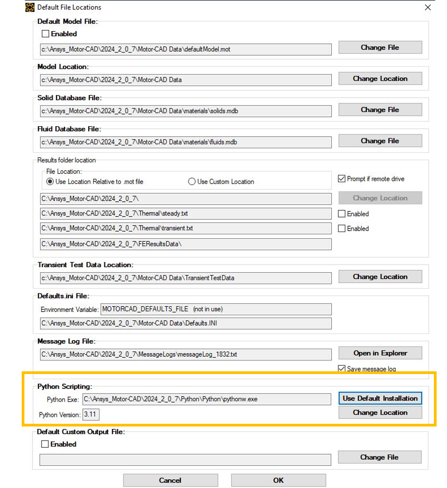

.. _ref_virtual_env_motorcad:

Using a Python virtual environment in Motor-CAD
===============================

You can use a Python virtual environment with Motor-CAD. By default, Motor-CAD uses the Python 
that comes with the Motor-CAD installation. 

Create a local Python virtual environment
*******************************
.. note::
    If you are using a Python IDE, this will usually create a virtual environment for you when you 
    start a new project. In this case, you can skip the section below, which describes how to create
    a virtual environment from the command line.

If Python is already installed, you can check the version by running the following command in a terminal.
(You can use the Windows terminal or any terminal integrated with an IDE
such as Visual Studio Code or PyCharm.)

.. code-block:: console

    python --version

Based on the Python version, you create a virtual environment:

.. code-block:: console

    python -m venv virtual_environment_folder_location

Activate the newly created virtual environment:

In case of Windows Powershell 

.. code-block:: console

     .\virtual_environment_folder_location\Scripts\activate.ps1

In case of Windows Command Prompt 

.. code-block:: console

     .\virtual_environment_folder_location\Scripts\activate.bat

Depending on the terminal specification, the virtual environment name might be highlighted.
Use ``pip`` to install all needed packages, such as :code:`ansys.motorcad.core` and :code:`bezier`. 

.. code-block:: console

     pip install ansys.motorcad.core bezier numpy

In the terminal window the preceding commands might look like this:

.. figure:: ../images/python_venv_summary.png
    :width: 500pt

Change the Python EXE file path in the Motor-CAD UI
*******************************
Proceed to change the Python Exe file path in **Defaults>Default File Locations**. This
should point to the :code:`pythonw.exe` file in the  :code:`Scripts` folder of the virtual environment
as shown below.

.. figure:: ../images/change_python_location.png
    :width: 500pt

The new Python file path is updated accordingly, and Python version is recognized by the 
Motor-CAD UI. 

.. figure:: ../images/changed_python_location.png
    :width: 500pt