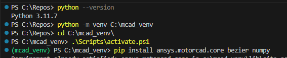

.. _ref_virtual_env_motorcad:

Using a Python virtual environment in Motor-CAD
===============================

User have a flexibility to use python virtual environment with Motor-CAD. By default Motor-CAD uses python 
comes with Motor-CAD installation. 

.. figure:: ../images/defaults_python_path.PNG
    :width: 500pt

Creating a new local Python virtual environment
*******************************
If python is already installed we can check the python version by following command in a terminal
(windows terminal or any terminal integrated with IDE such as VSCODE or PyCharm)

.. code-block:: console

    python --version

Based on the above python version, a virtual environment can be created

.. code-block:: console

    python -m venv virtual_environment_folder_location

Activate the newly created virtual environment

.. code-block:: console

     .\virtual_environment_folder_location\Scripts\activate.ps1

Based on terminal specification, the virtual environment name may highlight here. Install all needed
packages such as  :code:`ansys.motorcad.core` ,  :code:`bezier`  via pip etc. 

.. code-block:: console

     pip install ansys.motorcad.core bezier numpy

In terminal window the above commands may look like as shown below 

Change Python Exe file location in Motor-CAD UI
*******************************
Proceed to change the Python Exe file location in  :code:`Defaults>Default File Locations` . This
should point to  :code:`pythonw.exe`  file under  :code:`Scripts`  folder of the virtual environment 
as shown below. 

.. figure:: ../images/change_python_location.PNG
    :width: 500pt

The new python file path will be updated accordingly and python version will be recognized by the 
Motor-CAD UI. 

.. figure:: ../images/changed_python_location.PNG
    :width: 500pt